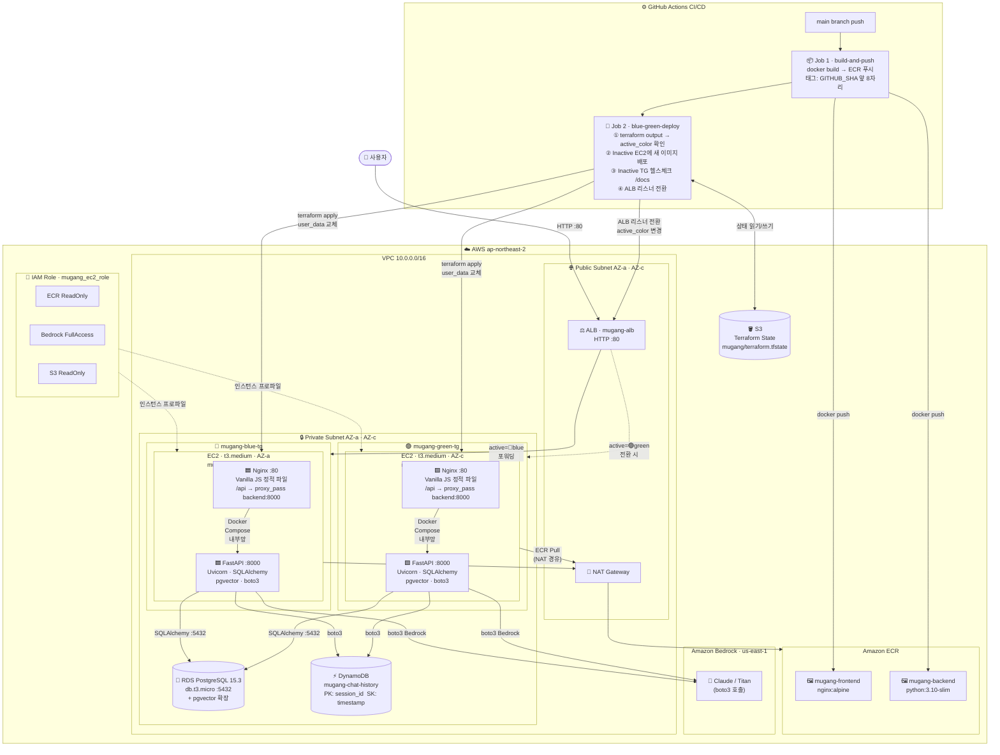

# mugang_aws로 rds 실행

1. 터미널에서 SSH 켜기
cd c:/mugang_aws

ssh -i "mugang-key.pem" -L 5432:terraform-20260303070103185000000001.cba8sagacwbn.ap-northeast-2.rds.amazonaws.com:5432 ec2-user@3.34.141.17 -N

2. backend
uvicorn main:app --host 0.0.0.0 --port 8000

3. 교직원 로그인 정보
staff / 123123123

# 터미널에서 도커 실행할 도커 명령어

1. 컨테이너 중지 및 삭제	서비스를 완전히 종료
docker-compose down

2. 서버가 멈췄을 때 단순히 다시 켜고 싶을 때
docker-compose restart

3. 코드 수정 사항을 반영하여 서버를 새로 띄우고 싶을 때
docker-compose up --build

4. 전체 로그 확인 (실시간)
docker-compose logs -f

5. 특정 서비스(예: backend) 로그만 확인
docker-compose logs -f backend

6. 도커 리빌드 명령어
docker-compose build --no-cache

# 아키텍처 구조

구분	구성 요소	상세 내용	비고
CI/CD	GitHub Actions	Job 1: Docker Build & Push (ECR)Job 2: Terraform Blue/Green 배포	deploy.yml
Network	ALB	mugang-alb (HTTP :80)	Blue/Green 트래픽 전환
NAT Gateway	Private EC2의 외부 통신(ECR Pull 등) 지원	Public Subnet 위치
Compute	EC2 (Blue/Green)	t3.medium (Amazon Linux 2023)Docker Compose (Nginx + FastAPI)	compute.tf
ECR	mugang-frontend, mugang-backend	컨테이너 이미지 저장소
Database	RDS	PostgreSQL 15.3 (db.t3.micro)	pgvector 확장 사용
DynamoDB	mugang-chat-history	채팅 기록 저장 (PK: session_id)
AI/ML	Amazon Bedrock	Claude / Titan 모델	us-east-1 리전 호출 (boto3)
Security	IAM Role	mugang_ec2_role	ECR Read, Bedrock Full, S3 Read
IaC	Terraform	S3 Backend (mugang/terraform.tfstate)	상태 관리 및 인프라 프로비저닝