# 무강대학교 AI 학사행정 서비스 (FastAPI + Vanilla JS)

정적 HTML/Vanilla JS 화면과 `backend/` FastAPI 서버를 한 저장소에서 함께 운영하는 학사행정 웹앱입니다.  
학생/교직원 로그인, 수강신청, 관리자 운영, RAG 챗봇 기능을 제공합니다.

## 빠른 시작

```bash
docker compose up -d --build
```

실행 후 확인:

- 메인 화면: `http://localhost:8888`
- API 문서: `http://localhost:8000/docs`
- 헬스체크: `http://localhost:8000/api/health`

종료:

```bash
docker compose down
```

데이터 볼륨까지 삭제:

```bash
docker compose down -v
```

## 저장소 아키텍처


핵심 구성:

- `backend/`: FastAPI API, 인증/수강/관리자/RAG 비즈니스 로직
- `frontend/`: 로그인/학생/관리자 화면 HTML, JS, CSS
- `terraform/`: AWS 인프라(VPC, EC2 Blue/Green, RDS, DynamoDB, ECR)
- `.github/workflows/`: 배포/삭제 파이프라인(`deploy.yml`, `destroy.yml`)
- `images/`: 제출/발표용 화면 캡처

실행 흐름:

1. 브라우저가 `frontend`(Nginx)로 접속
2. 프론트 JS가 FastAPI(`/api/v1/...`) 호출
3. FastAPI가 PostgreSQL 중심으로 트랜잭션 처리
4. 챗봇/추천 기능은 Bedrock 연동 경로 사용

## 주요 환경 변수

- `DATABASE_URL`
- `JWT_SECRET_KEY`
- `ACCESS_TOKEN_TTL_MINUTES`
- `REFRESH_TOKEN_TTL_MINUTES`
- `AWS_REGION`
- `BEDROCK_MODEL_ID` (사용 시)

샘플: [backend/.env.example](backend/.env.example)

## API 와 화면 매핑

| 화면 | 경로 | 핵심 API |
| --- | --- | --- |
| 로그인 | `frontend/pages/auth/login.html` | `POST /api/v1/auth/login` |
| 학생 대시보드 | `frontend/pages/student/dashboard.html` | `GET /api/v1/lectures`, `POST /api/v1/enrollments` |
| 학생 시간표/신청내역 | `frontend/pages/student/dashboard.html` | `GET /api/v1/enrollments/{user_id}` |
| AI 챗봇 | `frontend/pages/student/chat.html` | `POST /api/v1/chat/ask`, `POST /api/v1/student/ai/recommend` |
| 관리자 과목 관리 | `frontend/pages/admin/course_management.html` | `POST /api/v1/admin/courses`, `DELETE /api/v1/admin/courses/{lecture_id}` |
| 관리자 일정 관리 | `frontend/pages/admin/enrollment_schedule.html` | `GET/POST /api/v1/admin/enrollment-schedule` |
| 관리자 RAG 업로드 | `frontend/pages/admin/rag_update.html` | `POST /api/v1/admin/rag/upload` |
| 관리자 서버 상태 | `frontend/pages/admin/server_management.html` | `GET /api/v1/admin/system-status` |

## 배포 아키텍처

### AWS / Terraform + Blue Green

- 프록시 EC2(Nginx) 1대가 외부 진입점
- 앱 서버는 Blue/Green ASG로 롤링 전환
- 메인 DB는 RDS PostgreSQL
- 보조 NoSQL은 DynamoDB(`mugang-chat-history`)
- 이미지 저장소는 ECR(frontend/backend)

### Local / Docker Compose

- `db`(pgvector), `backend`, `frontend` 3개 컨테이너
- 단일 명령으로 로컬 재현 가능

### K8s (참고 구성)

- `k8s/backend-deployment.yaml`
- `k8s/frontend-deployment.yaml`

현재 운영 메인은 Terraform 경로이며, `k8s/`는 보조 실습/참고 성격입니다.

## AWS 환경 분석

현재 코드 기준 AWS 역할 분담은 아래와 같습니다.

| 저장소 자산 | AWS 매핑 리소스 | 역할 |
| --- | --- | --- |
| `frontend/` | EC2 Proxy + Nginx | 정적 화면 서빙 |
| `backend/main.py` | EC2(Blue/Green ASG) | FastAPI API 런타임 |
| `terraform/rds.tf` | RDS PostgreSQL | 핵심 트랜잭션 저장 |
| `terraform/dynamodb.tf` | DynamoDB | 챗 이력/보조 데이터 |
| `terraform/ecr.tf` | ECR | 이미지 레지스트리 |
| `.github/workflows/deploy.yml` | GitHub Actions + AWS CLI/Terraform | 빌드/푸시/전환 자동화 |

운영 체크 포인트:

- `terraform output active_color`로 활성 색상 확인
- `/api/health` 및 `/docs`로 애플리케이션 상태 확인
- SSM 기반 원격 점검으로 서버 접근

## 환경 분리 전략

| 환경 | 주 용도 | 런타임 | DB | 진입점 |
| --- | --- | --- | --- | --- |
| `local` | 개인 개발/디버깅 | Docker Compose | 로컬 PostgreSQL | `localhost:8888`, `localhost:8000` |
| `aws-dev` | 통합 테스트 | EC2 Blue/Green | RDS PostgreSQL | Proxy Public IP |
| `aws-prod-like` | 운영 리허설 | EC2 Blue/Green | RDS PostgreSQL | Proxy Public IP |

## local / dev / stage / prod 구성 구분

### 1. Local

- 목적: 기능 구현 및 API 빠른 확인
- 방식: `docker compose up -d --build`
- 장점: 실행/복구가 빠름

### 2. Dev

- 목적: 팀 통합 테스트
- 방식: Terraform + GitHub Actions
- 확인: `/api/health`, `/docs`, 핵심 화면 동작

### 3. Stage

- 목적: 배포 리허설, Blue/Green 전환 검증
- 방식: `deploy.yml` 자동 배포
- 확인: inactive ASG 헬스체크 후 프록시 전환

### 4. Prod

- 목적: 실제 운영
- 방식: Stage와 동일한 경로 + 비밀값/권한 분리
- 원칙: 롤백 가능한 Blue/Green 유지

## K8s / EKS / API Gateway / Lambda 역할 구분

| 구성 요소 | 현재 저장소 적합도 | 역할 |
| --- | --- | --- |
| Terraform + EC2 Blue/Green | 높음 | 현재 메인 운영 경로 |
| K8s 매니페스트 | 보통 | 참고/학습/보조 배포 |
| API Gateway + Lambda | 낮음~보통 | 향후 분리형 API 또는 이벤트 처리 확장 |
| EKS | 보통 | 필요 시 컨테이너 오케스트레이션 전환 후보 |

## CI/CD 구성

핵심 워크플로:

- [.github/workflows/deploy.yml](.github/workflows/deploy.yml)
  - Frontend/Backend 이미지 빌드
  - ECR 푸시
  - Terraform apply 기반 Blue/Green 전환
  - SSM으로 헬스체크 및 Proxy 업스트림 스위치
- [.github/workflows/destroy.yml](.github/workflows/destroy.yml)
  - 수동 트리거로 전체 리소스 정리

## Mermaid 다이어그램

### AWS 인프라 플로우

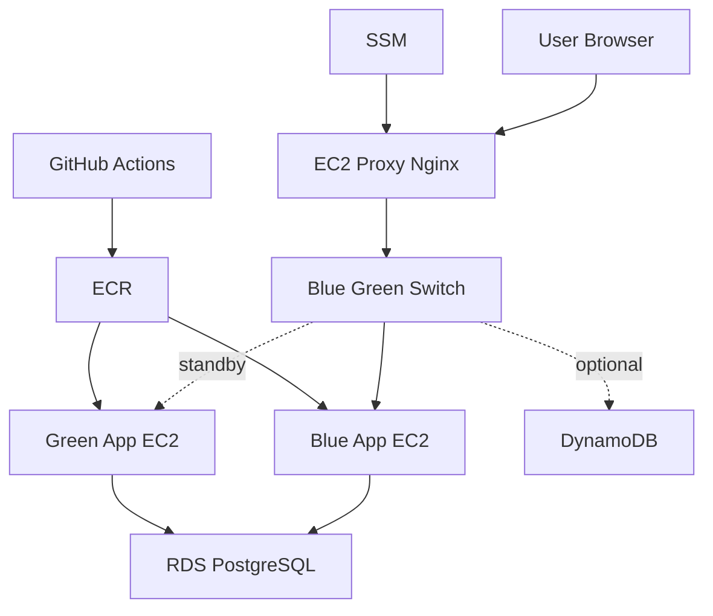

### 서비스 런타임 플로우

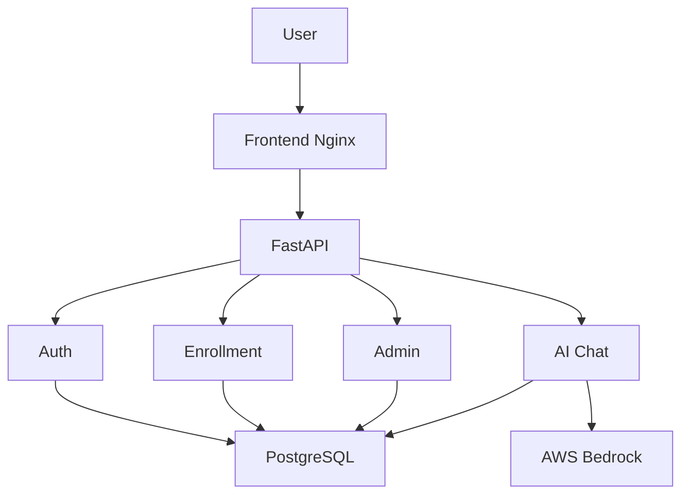

### 챗봇 요청 시퀀스

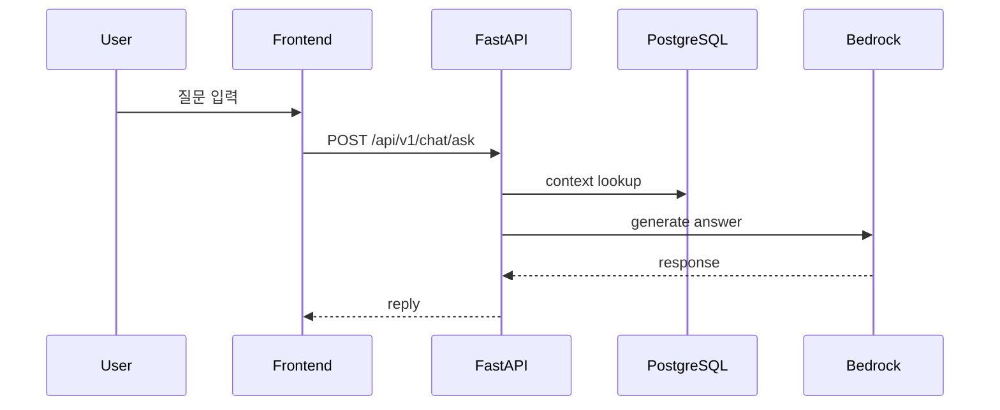

## 화면 갤러리

### 1. 사용자 화면

- 로그인 화면

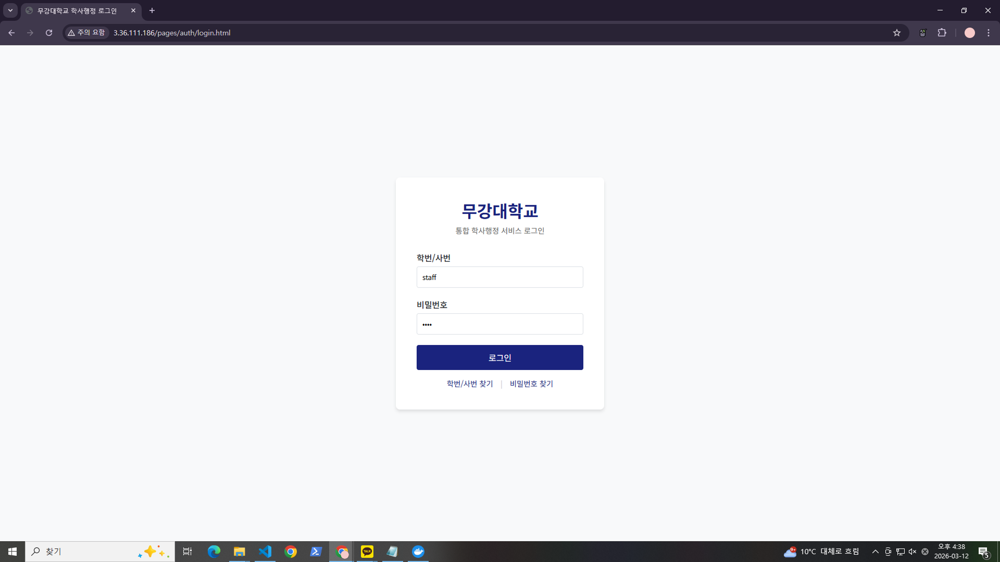

- 학생 대시보드(수강신청)

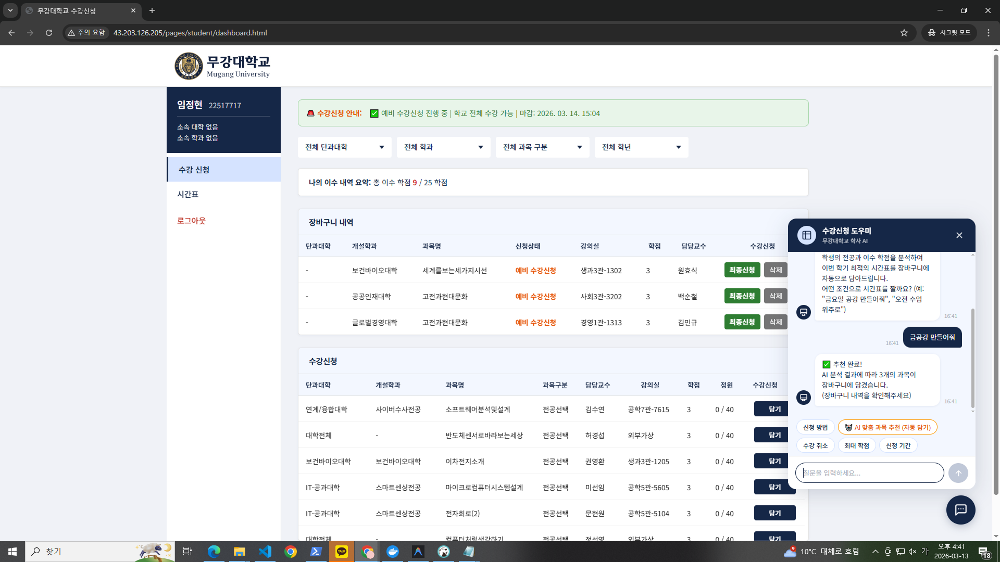

- 학생 시간표

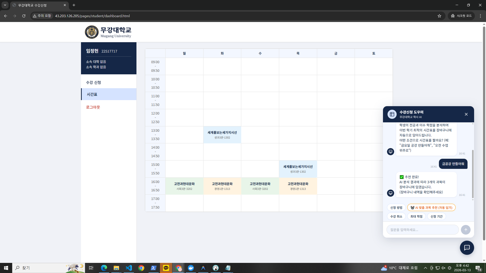

### 2. 관리자 화면

- 과목 관리

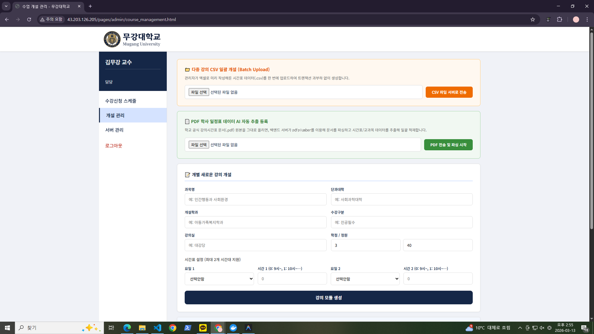

- 수강신청 일정 관리

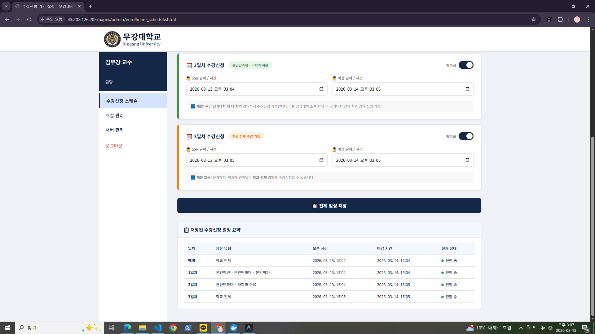

- RAG 업데이트

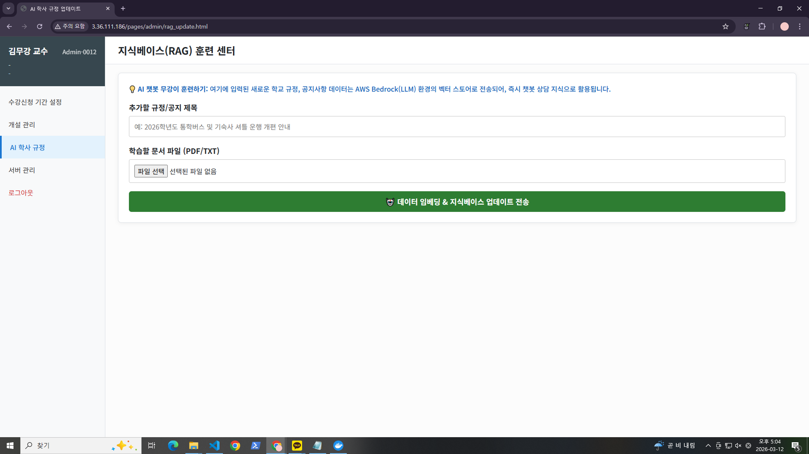

- 서버 관리

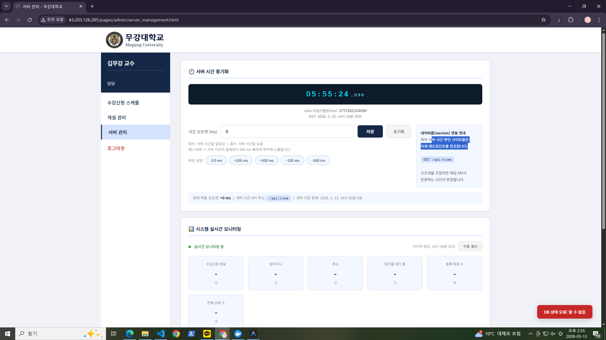

### 3. AWS / CI 증적

- EC2 인스턴스

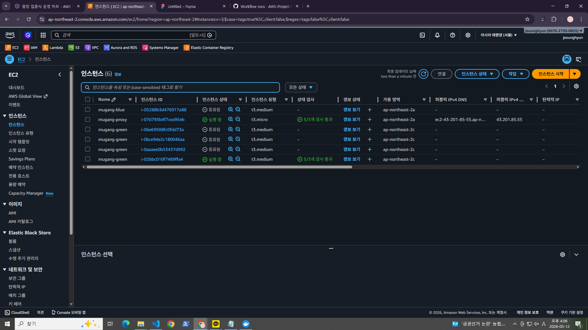

- RDS 상세

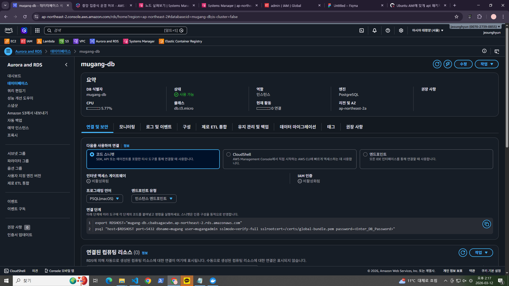

- ECR 리포지토리

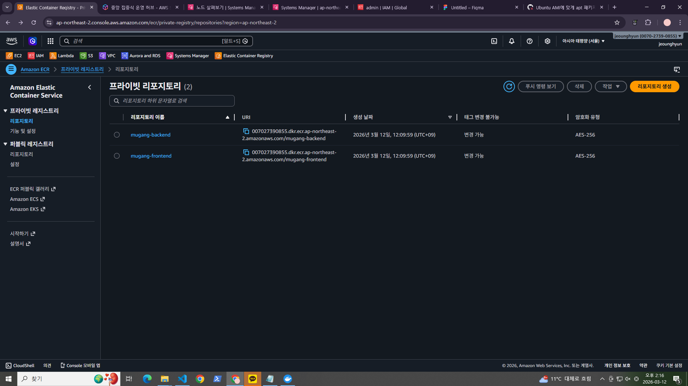

- GitHub Actions 배포 성공

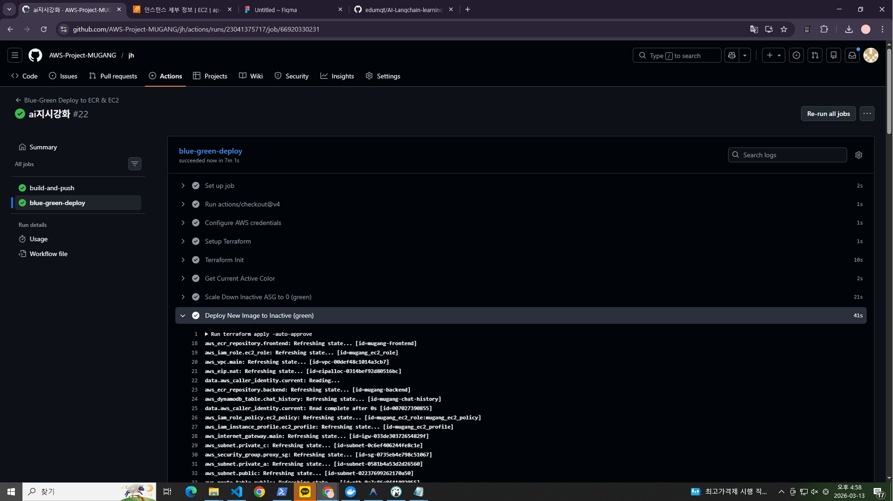

## AWS 순차 실행 가이드

### 1. Terraform Init

```bash
cd terraform
terraform init -backend-config="bucket=<TF_STATE_BUCKET>" -backend-config="key=mugang/terraform.tfstate" -backend-config="region=ap-northeast-2"
```

### 2. Plan / Apply

```bash
terraform plan
terraform apply -auto-approve
```

### 3. 출력 확인

```bash
terraform output
```

확인 대상:

- `proxy_public_ip`
- `rds_endpoint`
- `active_color`

### 4. 리소스 정리

```bash
terraform destroy -auto-approve
```

