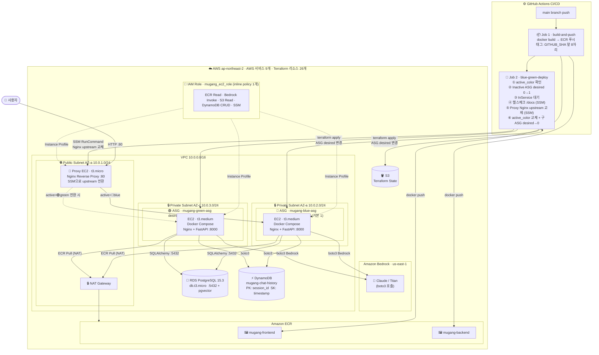

# ☁️ 무강대학교 AI 학사행정 인프라 구축 발표자료

## 📝 발표 개요
- **주제**: 비용 효율적인 MSA 기반 AI 학사행정 시스템 클라우드 인프라 구축
- **발표 시간**: 총 10분 (발표자 A: 5분, 발표자 B: 5분)
- **핵심 포인트**: Terraform을 활용한 IaC 구현과 AWS 리소스 선정의 기술적 근거

---

## 🗣️ 발표자 A: 인프라 아키텍처 및 네트워크 보안 설계 (0분 ~ 5분)

### 1. 프로젝트 기획 의도 및 기술 스택 (1분 30초)
- **Storytelling (기획 배경)**:
  - **문제 인식**: 기존 학사행정 시스템은 수강신청 기간의 **트래픽 폭주**와 단순 반복적인 **학사 문의** 처리에 취약했습니다.
  - **해결책**: 트래픽 유연성을 위한 **MSA(Microservices Architecture)** 도입과, 문의 자동화를 위한 **AI(RAG)** 기능을 결합했습니다.
  - **차별점**: 단순 구현을 넘어, **Terraform**을 이용한 인프라 자동화(IaC)로 '재현 가능한 인프라'를 구축했습니다.
- **주요 기술 스택 (Tech Stack)**:
  - **Infrastructure**: AWS (EC2, VPC, RDS, S3, ECR), Terraform, Docker
  - **Application**: Python FastAPI (Backend), Vanilla JS (Frontend), Docker Compose
  - **AI & Data**: Amazon Bedrock (LLM), RDS for PostgreSQL (pgvector)

### 2. 전체 아키텍처 및 네트워크 격리 전략 (1분 30초)
- **아키텍처 구조 (Architecture)**:

- **트래픽 흐름**: 사용자 요청 → Proxy EC2(Nginx) → Active Blue/Green EC2(FastAPI). ALB 없이 Proxy EC2가 트래픽을 라우팅합니다.
- **Why Private Subnet? (보안 강화)**:
  - Blue/Green EC2와 RDS를 Private Subnet에 배치하여 인터넷에서 직접 접근 불가. 허용 경로(Proxy EC2)를 통해서만 접근 가능합니다.
- **Why NAT Gateway? (패치 및 업데이트)**:
  - Private EC2가 ECR에서 Docker 이미지 Pull, OS 보안 패치 등 외부 통신 시 단방향 통로로 활용합니다.
- **Why ASG? (비용 절감 + 자동 복구)**:
  - 비활성 환경 `desired=0` → EC2 비용 0. 장애 시 자동 재시작. 배포 시에만 `desired=1`로 스케일업합니다.

### 3. 보안 그룹 및 접근 제어 (2분)
- **리소스**: `aws_security_group`, `Bastion Host`
- **Why Bastion Host? (운영 보안)**:
  - `db_connect.md` 가이드를 보시면, 개발자조차도 DB에 직접 접속할 수 없습니다.
  - 반드시 **Bastion Host(경비실 서버)**를 통해서만 **SSH 터널링**으로 접근하도록 설계하여, 운영 단계에서의 보안 구멍을 원천 차단했습니다.

---

## 🗣️ 발표자 B: 컴퓨팅, 데이터베이스 및 AI 파이프라인 (5분 ~ 10분)

### 4. 비용 효율적 컴퓨팅 리소스 설계 (2분)
- **리소스**: `aws_instance` (compute.tf), `Docker Compose`
- **Why EC2 + Docker? (EKS 대신)**:
  - 저희는 프로젝트의 규모와 예산을 고려하여, 월 10만원 이상의 고정 비용이 발생하는 EKS 대신 **단일 EC2 인스턴스**와 **Docker Compose**를 조합하는 실용적인 접근을 택했습니다.
  - 보안 강화를 위해 NAT Gateway를 도입하여 비용이 다소 상승했지만, 여전히 **월 7~8만원 대**의 합리적인 비용으로 MSA와 AI 기능이 포함된 인프라를 운영할 수 있습니다.
- **★ 핵심 전략 1: 스팟 인스턴스를 활용한 비용 극대화**
  - 저희는 온디맨드 대비 최대 90% 저렴한 **스팟 인스턴스(`t3.medium`)**를 활용하여 EC2 비용을 월 10달러 수준으로 절감했습니다.
  - 수강신청처럼 중단에 민감한 서비스가 아니므로, 비용 효율을 극대화하는 것이 합리적이라 판단했습니다.
- **★ 핵심 전략 2: T3 Burstable 인스턴스 채택**
  - T3 인스턴스는 평소에는 낮은 CPU를 사용하며 비용을 절약하다가, AI 추론이나 트래픽 증가 시 순간적으로 CPU 성능을 최대로 끌어올리는 **'버스터블'** 특징이 있습니다.
  - 이를 통해 최소 비용으로 예상치 못한 트래픽에 유연하게 대응하는 효율적인 구조를 만들었습니다.

### 5. 데이터베이스 전략 (1분 30초)
- **리소스**: `aws_db_instance` (rds.tf)
- **Why RDS for PostgreSQL?**:
  - 직접 DB 서버를 설치하고 관리하는 부담을 줄이기 위해 완전 관리형 서비스인 **RDS**를 선택했습니다.
  - 특히 **pgvector** 확장이 용이하여, 향후 AI RAG(검색 증강 생성) 기능을 별도 벡터 DB 구축 없이 관계형 DB 레벨에서 바로 지원할 수 있도록 확장성을 고려했습니다.

### 6. AI 파이프라인 및 CI/CD (1분 30초)
- **리소스**: `GitHub Actions`, `ECR`, `Amazon Bedrock`
- **Why CI/CD?**:
-  `study.md`의 CI/CD 파이프라인에 따라, 코드가 푸시되면 Github Actions가 자동으로 도커 이미지를 빌드해 ECR에 저장합니다. EC2 서버는 이 최신 이미지를 내려받아 서비스를 업데이트합니다. 이를 통해 개발자가 인프라에 신경 쓰지 않고 코드에만 집중할 수 있습니다.
- **Why Bedrock?**:
  - 자체 LLM을 호스팅하는 막대한 GPU 비용 대신, API 기반의 **Amazon Bedrock**을 사용하여 사용한 만큼만 비용을 지불하는 합리적인 구조를 택했습니다.

---

## 💡 예상 질문 및 답변 (Q&A 대비)

**Q1. 왜 EKS 대신 EC2와 Docker Compose를 사용했나요?**
> A. 저희 프로젝트의 목표는 '최소 비용으로 MSA 아키텍처 구현'이었습니다. EKS는 강력한 도구지만 컨트롤 플레인 비용만으로 월 10만원에 가깝습니다. 저희는 EC2 스팟 인스턴스와 Docker Compose를 활용해 **월 7~8만원대**의 비용으로 MSA를 성공적으로 구축하며, 비용 효율성을 증명하는 데 집중했습니다.

**Q2. 비용 절감 전략은 무엇인가요?**
> A. 크게 세 가지입니다.
> 1. **EC2 스팟 인스턴스 활용**: 온디맨드 대비 훨씬 저렴한 스팟 인스턴스를 사용해 컴퓨팅 비용을 극적으로 낮췄습니다.
> 2. **T3 Burstable 인스턴스 채택**: 평소에는 비용을 아끼고, 필요할 때만 성능을 최대로 사용하는 T3 인스턴스로 효율을 높였습니다.
> 3. **서버리스 적극 활용**: S3, Lambda, Bedrock 등 사용한 만큼만 비용을 내는 서버리스 서비스를 AI 파이프라인에 적용하여 유휴 비용을 없앴습니다.
> 추가적으로, 보안 강화를 위해 도입한 NAT Gateway가 고정 비용의 일부를 차지하지만, 이를 통해 얻는 보안적 이점이 더 크다고 판단했습니다.